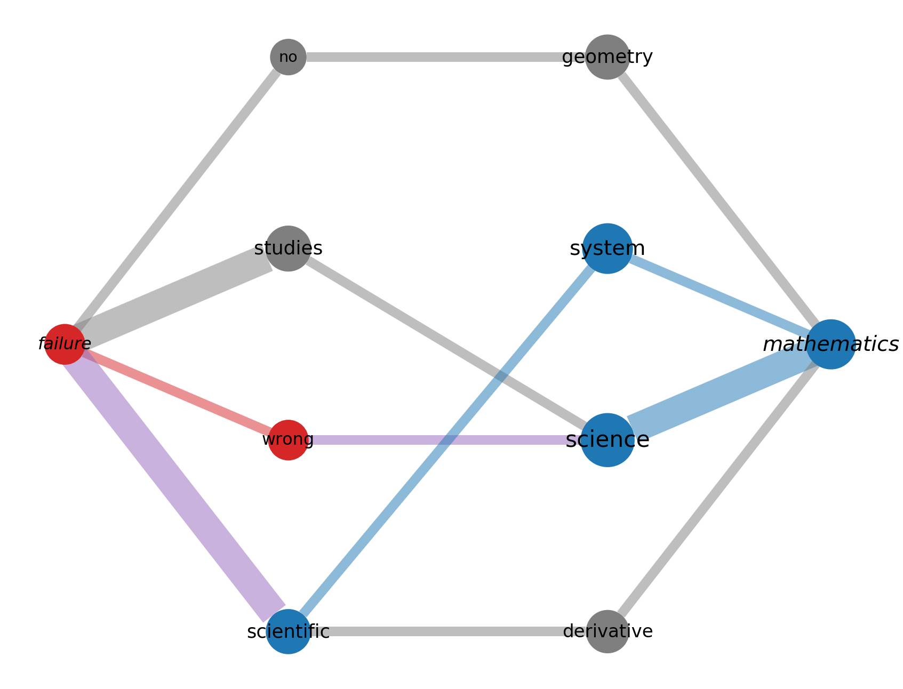
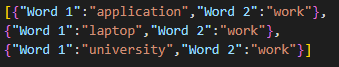

A Python library for the visualisation and manipulation of Mindset Stream Graphs.


## Description

Mindset Streams provides the functionality to visualise Mindset Stream Graphs from raw data and calculate relevant statistics such as path types and type betweenness centrality. Mindset Streams are complex networks which dsiplay the conceptual connections between a keyword pair found in the mental lexicon of subjects. This conceptual data is enriched withs entiment data in order to extract insights regarding subject perceptions.




## Installation
Mindset Streams installs with pip:

```
~$ pip install Mindset-Streams==0.0.11
```


## Usage
The Mindset Stream package requires association and sentiment data in the form of a JSON file as shown below. A demonstration of the package is provided in the Demo folder.

